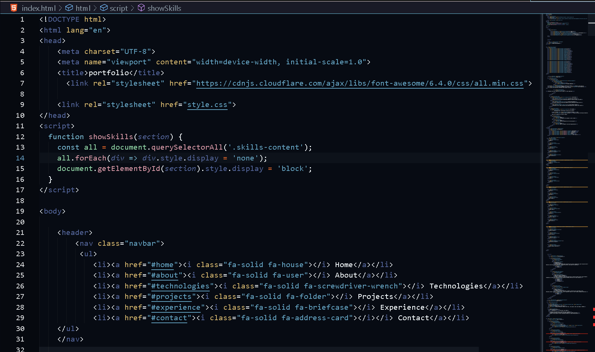

# Synthor Dark

A **sleek and modern dark theme for VS Code** with carefully selected colors for better readability and reduced eye strain.  
Designed for developers who love coding in a clean and stylish environment.

---

## ✨ Features

✅ Smooth and eye-friendly color palette  
✅ Minimal and distraction-free UI  
✅ Perfect for long coding sessions  
✅ Great syntax highlighting for multiple languages  

---

## Preview

---

## 🚀 Installation

1. Open **Extensions** in VS Code (`Ctrl + Shift + X` or `Cmd + Shift + X` on Mac)  
2. Search for **"Synthor Dark"**  
3. Click **Install**  

---

## 🛠 Requirements

- VS Code **v1.60.0** or higher

---

## 📝 Changelog

### 1.0.0  
- Initial release 🎉

---

## 🌟 Feedback & Support

If you like this theme, please:  
⭐ **Rate it on the [Marketplace](https://marketplace.visualstudio.com/)**  

---

## 📌 Author

**Adina Hawaldar**  

---
